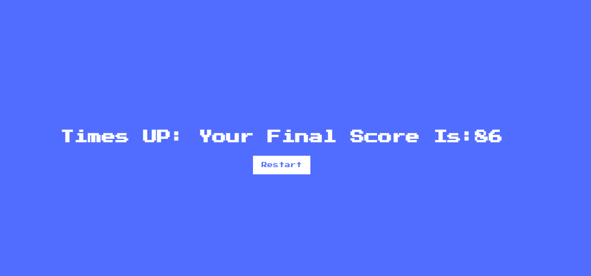

<h1 align="center">Insect Game</h1>

[View the live Project here](https://jyotihambir-bc.github.io/Insect-Game/)

Insect Game made for people for whom like to play something interesting and never ending game.

  
  - ### Existing Features
   
    - _01 Start Page Images_ 
      -  
        

    - _02 Game Page_ 
      - 
      - 
      - 
      - 

  - ### Features which could be implemented in future
    - Can be added more insect and features (e.g Previous Best Score) to make the game more creative.

  - ## Design
  
  - ### Typography
      - Google font - Google Fonts were used to import Press Start 2P fonts into css.style

  - ## Technology Used

  - ### Language Used
    - [HTML5](https://en.wikipedia.org/wiki/HTML5)
    - [CSS3](https://en.wikipedia.org/wiki/CSS)
    - [JavaScript](https://simple.wikipedia.org/wiki/JavaScript)

  - ### Frameworks, Libraries
    - [Google Font](https://fonts.google.com/) was used to import Poppins font, which is used in app.
    
  - ## Deployment

  - ### How this site was deployed

    - In the GitHub repository, navigate to the Settings tab, then choose Pages from the left hand menu 
    - From the source section drop-down menu, select the Master Branch
    - Once the master branch has been selected, the page will be automatically refreshed with a detailed  ribbon display to indicate the successful deployment
    - Any changes pushed to the master branch will take effect on the live project.

    The live link can be found here - [Insect Game](https://jyotihambir-bc.github.io/Insect-Game/)

  - ### Code
    - Took the help from ChatGPT and Stack Overflow.
    

 

 

  